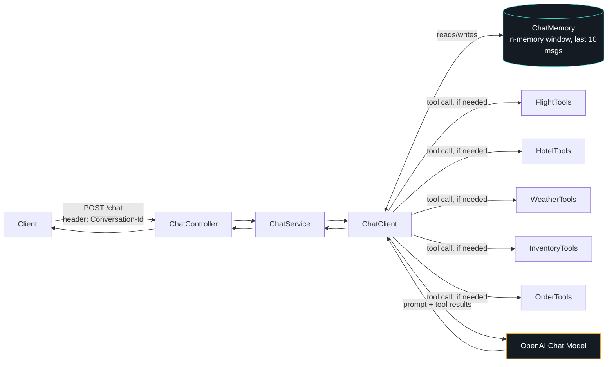

<div align="center">

# 🛰️ Spring AI Agent

### A tool-calling AI agent for travel planning &amp; customer support, built on Spring AI

*One conversational endpoint. Five live tools. It decides which one to use.*

[](https://openjdk.org/)
[](https://spring.io/projects/spring-boot)
[](https://spring.io/projects/spring-ai)
[](https://platform.openai.com/)
[](#license)

</div>

---

## What is this?

This is an **agentic** application, not a scripted chatbot. A single `ChatClient`, backed by GPT, is handed five tools — flight search, hotel search, weather forecasts, inventory lookups, and order cancellation — and decides *on its own*, per message, whether and which tool to invoke to answer the user. It holds a rolling conversational memory, so it can handle multi-turn exchanges like *"find me a flight to Goa"* → *"now show me hotels there"* without re-stating context.

This is the core pattern behind modern AI agents: give a language model a system prompt, a toolbox, and a memory, and let it orchestrate the rest.

---

## Table of contents

- [How it works](#how-it-works)
- [Tools onboard](#tools-onboard)
- [Tech stack](#tech-stack)
- [API reference](#api-reference)
- [Getting started](#getting-started)
- [Environment variables](#environment-variables)
- [Project structure](#project-structure)
- [Frontend](#frontend)
- [Known limitations](#known-limitations)
- [Roadmap](#roadmap)
- [License](#license)

---

## How it works



On every request, the model reads the system prompt (*"you are a helpful travel planning agent and customer support agent…"*), the conversation history for that `Conversation-Id`, and the current message — then decides for itself whether it needs to call a tool before it can answer, and which one.

---

## Tools onboard

| Tool | Signature | What it does |
|---|---|---|
| `searchFlight` | `(source, destination, date)` | Returns matching flights with airline and price |
| `searchHotel` | `(city, maxPrice)` | Returns hotels in a city under a nightly budget, with ratings |
| `getForecast` | `(city, date)` | Returns a weather forecast for a city and date |
| `checkStock` | `(productName)` | Checks unit availability for a product |
| `getAllProductsInStock` | `()` | Lists all products currently in stock |
| `getTotalProductsInStock` | `()` | Returns the total number of distinct products tracked |
| `cancelOrder` | `(orderId)` | Cancels an order by ID and returns its new status |

All data is currently served from in-memory sample datasets (a handful of flights, hotels, products, and orders) — swapping these for real service calls is a drop-in change, since each tool is a self-contained Spring `@Component`.

---

## Tech stack

| Layer | Technology |
|---|---|
| Language | Java 21 |
| Framework | Spring Boot 4.1.1 |
| AI orchestration | Spring AI 2.0.1 — `ChatClient`, `@Tool`-annotated tool calling, `MessageChatMemoryAdvisor` |
| LLM | OpenAI (`gpt-4o-mini` by default) |
| Memory | `MessageWindowChatMemory` — in-process, rolling 10-message window per conversation |
| Build | Maven |

---

## API reference

There is a single conversational endpoint:

```
POST /chat
Content-Type: text/plain
Conversation-Id: <any string that identifies this conversation>

<your message, as raw text>
```

**Response:** `200 OK` with the agent's reply as raw `text/plain` — no JSON envelope.

Example:

```bash
curl -X POST http://localhost:8080/chat \
  -H "Content-Type: text/plain" \
  -H "Conversation-Id: demo-session-1" \
  -d "Find me a flight from Delhi to Goa on 2026-08-21"
```

The `Conversation-Id` header is what ties messages together into one memory thread — reuse the same value across a session, and start a new one to reset context.

---

## Getting started

### Prerequisites

- Java 21
- Maven (or the bundled `./mvnw`)
- An OpenAI API key

### 1. Clone the repository

```bash
git clone https://github.com/Divyanshkackker15/spring-ai-agent.git
cd spring-ai-agent
```

### 2. Set environment variables

```bash
export OPENAI_API_KEY=sk-...
export CHAT_MODEL=gpt-4o-mini
```

### 3. Run the application

```bash
./mvnw spring-boot:run
```

The agent is now live at `http://localhost:8080`.

### 4. Open the console

A self-contained frontend is served from `src/main/resources/static/index.html`:

```
http://localhost:8080/index.html
```

> **Note:** don't hit `http://localhost:8080/` directly yet — `ViewController` currently routes the root path to a Thymeleaf template (`chat.html`) that hasn't been created, so that specific route will 404/error. `/index.html` bypasses it entirely.

---

## Environment variables

| Variable | Required | Default | Description |
|---|---|---|---|
| `OPENAI_API_KEY` | ✅ | `default-key` (placeholder, will fail) | Your OpenAI API key |
| `CHAT_MODEL` | – | `gpt-4o-mini` | Chat model used for orchestration and responses |

---

## Project structure

```
src/main/java/com/divyansh/aiagent/
├── config/
│   └── AiConfig.java          # ChatClient bean, system prompt, tool registration, chat memory
├── controller/
│   ├── ChatController.java    # POST /chat
│   └── ViewController.java    # / -> Thymeleaf view (currently unimplemented)
├── model/                     # Flight, Hotel, User records/POJOs
├── service/
│   └── ChatService.java       # Wraps ChatClient calls with conversation-scoped memory
└── tools/
    ├── FlightTools.java
    ├── HotelTools.java
    ├── WeatherTools.java
    ├── InventoryTools.java
    └── OrderTools.java
```

---

## Frontend

`index.html` is a single-file, zero-dependency console UI — no build step, no framework. It sends plain-text messages to `/chat` with a persistent `Conversation-Id`, displays the agent's replies with a typewriter reveal, and lists the five tools available to the model as a static reference panel. A "new session" action rotates the conversation ID to start a clean memory window.

---

## Known limitations

- **Chat memory is in-process only** — it resets on every application restart and isn't shared across multiple instances. Fine for a demo, not for production.
- **No persistence layer** — flights, hotels, stock, and orders are hardcoded sample data, not backed by a database.
- **No authentication** — the `/chat` endpoint is open; anyone with the URL can use it and consume your OpenAI quota.
- **`/` route is broken** — see the note under [Getting started](#getting-started).

---

## Roadmap

- 🗄️ **Persistent chat memory** — back `ChatMemory` with a database-backed store so history survives a restart
- 🔌 **Real backend integrations** — replace the in-memory tool datasets with actual flight/hotel/inventory APIs
- 🔐 **Authentication** — JWT-based auth so conversations and actions (like order cancellation) are scoped to a verified user
- 📊 **Tool-call observability** — surface which tool was invoked and why, for debugging and for a more transparent agent UI
- ☁️ **Deployment** — containerize and deploy behind a rate limiter

---

## License

Distributed under the MIT License. See `LICENSE` for details.
